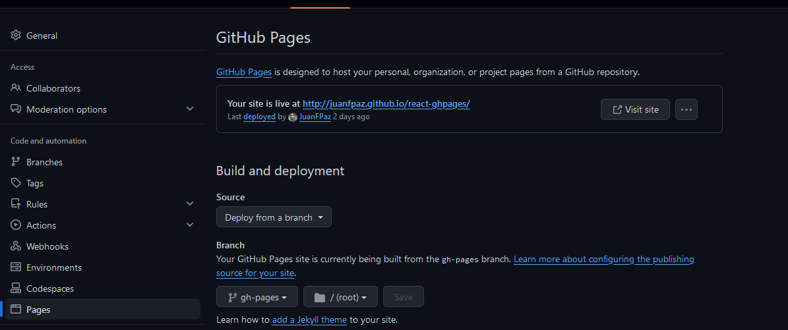

# React/Vite + GitHub Pages

[Github Pages](https://docs.github.com/es/pages/getting-started-with-github-pages/about-github-pages) es un servicio de hosting gratuito que nos permite subir nuestros sitios web estaticos creados con `HTML`, `CSS` y `Javascript`.

Lo bueno de este servicio de hosting, es que con el paso del tiempo, tambien se pudo incorporar en herramientas como `React`, `Angular`, etc...

Hoy vamos a aprender a como `desplegar un sitio en Github Pages` con `React y Vite`.

## Crear un Proyecto de React/Vite

Iniciamos un proyecto de React con Vite utilizando el comando:

```npm create vite <nombre-del-proyecto> -- --template```

En este caso, `<nombre-del-proyecto>`, yo lo llame `react-ghpages`.

Si utilizamos este comando, vamos a tener que seleccionar una serie de opciones, como por ejemplo que vamso a crear un proyecto de `React` y vamos a utilizar `Javascript`.

Cuando se termine de cargar el proyecto, corremos el comando `cd <nombre-del-proyecto>` y `npm install` para terminar de configurar nuestro entorno.

Para finalizar este paso, vamos a iniciar un repositorio local de `Git`, con el siguiente comando:

`git init`

## Crear un Repositorio remoto en Github

Para utilizar `Github Pages`, necesitamos tener un repositorio remoto, con nuestro proyecto. Para eso nos dirigmos a [Github](htts://github.com) y creamos un nuevo repositorio publico (puede ser privado, pero solo funciona con la version paga de `Github`) y colocamos el nombre del proyecto.

En esta parte, `Github Pages` nos permite 2 formas de crear un repositorio remoto para desplegar un sitio:

1. Podemos crear un repositorio con el nombre de nuestro usuario (en minisculas en el caso que tu usuario contenga mayusculas), mas la siguiente extension:

    - Nombre del Repositorio: ```<nombre-de-usuario>.github.io```
    - URL del sitio desplegado: ```https://<nombre-del-usuario>.github.io/```

    Se puede decir que este seria la raíz de nuestro sitio web. Este paso solo se puede hacer una vez.

2. Podemos crear un repositorio simplemente con el nombre del proyecto:

    - Nombre del Repositorio: ```react-ghpages```
    - URL del sitio desplegado: ```https://<nombre-del-usuario>.github.io/<nombre-del-repositorio>/```

    Este paso, lo podemos repetir con diferentes proyectos.

Una vez, creado el repositorio remoto, tenemos que enlazarlo a nuestro repositorio local, donde se encuentra nuestro proyecto de react que vamos a desplegar. Para eso volvemos a nuestro proyecto, y en la terminal ejecutamos el siguiente comando:

```git add remote origin <URL-del-repositorio-remoto>```

Para verificar que se enlazo nuestro repositorio remoto en el repositorio local ejecutamso el siguiente comando:

```git branch -a```.

## Instalar gh-pages y configurar Vite.config.js

Una vez configurado nuestros repositorios, vamos a instalar `gh-pages` como dependencia de desarrollo con el siguiente comando:

```npm install gh-pages --save-dev```

Y en nuestro package.json, agregamos el siguiente `script`:

```json
  "scripts": {
    "deploy": "gh-pages -d dist",
    "dev": "vite",
    "build": "vite build",
    "lint": "eslint . --ext js,jsx --report-unused-disable-directives --max-warnings 0",
    "preview": "vite preview"
  },
```

Luego, en el archivo [vite.config.js](./vite.config.js), colocamos dentro del `defineConfig`, la propiedad `base:`:

```js
import { defineConfig } from 'vite'
import react from '@vitejs/plugin-react'

// https://vitejs.dev/config/
export default defineConfig({
  plugins: [react()],
  base: '/react-ghpages/'
})
```

**NOTA:** La propiedad base varia dependiendo de que tipo de repositorio remoto hayamos creado. Si creamos el repositorio con nuestro nombre de usuario, por ejemplo: `juanfpaz.github.io`, el base sera `'/'`.
Si creamos el repositorio con el nombre del proyecto, el base sera : `'/react-ghpages/'`.

Para finalizar, primero confirmamos los cambios en nuestro repositorio, haciendo el `git add .`, `git commit -m "Primer commit"`, `git push origin main`.

## Desplegar nuestra aplicacion

Para desplegar la aplicacion, `Vite` nos otorga dos comandos que se encuentran en los scripts de nuestro `package.json`. Estos comandos son:

- `npm run build`: Se encarga de compilar todo nuestro codigo que se encuentra en la carpeta `src` y los archivos restantes que se encuentran en la carpeta public. Es decir, se encarga de crear la aplicacion final en una carpeta llamada `dist`.

- `npm run preview`: Tiene una funcion similara `npm run dev`, pero la diferencia es que ejecuta en un entorno de prueba, lo que hayamos desplegado con el comando `npm run build`. Es una buena practica utilizar estos dos comandos, como testeo antes de hacer el despliegue, y poder reconocer los errores con más facilidad.

Siempre que hacemos un cambio en nuestra aplicacion, tenemos que volver a ejecutar el comando `npm run build`.

Una vez que se haya creado nuestra carpeta `dist`, ejecutamos el comando `npm run deploy`, que creamos en el paso anterior, para subir nuestro a `Github Pages.`

Cuando se termine de desplegar, nos dirigimos a nuestro repositorio remoto, vemos que se creo una nueva rama llamada `gh-pages`, con el contenido a desplegar.

Nos dirigimos a `Settings` de nuestro repositorio remoto, dentro de `code and automation` nos dirigmos a la seccion `Pages`, y nos va a brindar la `URL` de nuestro sitio desplegado. (Puede ser que este paso demore en aparecer, debido a que se esta terminando de configurar `Gh-pages` internamente)



Podemos entrar a la URL que nos provee `GH-Pages` y ver el contenido de nuestra aplicacion. No pasa nada si cuando entras a la primera, solamente aparece un error de `404` de `Github`, ya que tambien, puede ser que nuestro contenido tarde en cargase y mostrarse. Es solo cuestion de paciencia.
